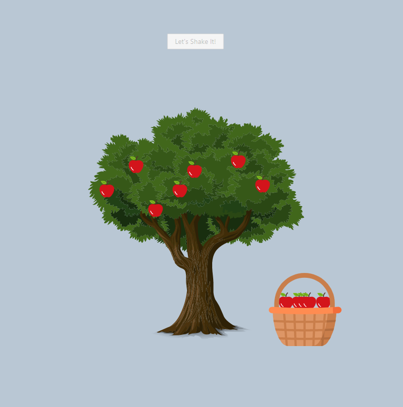

### Demo

You can access to DEMO from that link.

<a href="http://shaketree.surge.sh/">Here is a Demo Link</a>

### `npm start`

Runs the app in the development mode.\
Open [http://localhost:3000](http://localhost:3000) to view it in the browser.

# Shake Tree

For install packages "yarn install" or "npm install"

For run app "yarn start" or "npm run start"

<h3>Story:</h3>

There is a tree with big, juicy and red apples on it. We want to collect those apples but we can't reach them. Because the tree is very high. We have to shake the tree to drop apples. After that, we can put the apples to our apple basket.

 

<h3>Description</h3>

There will be 4 objects on the screen. Apples, tree, basket and a button. You can use any image (SVG is plus) for these. After clicking the tree will shaking for 3 seconds. After shaking effect, more than one apple will be dropped in different time. The apples will appear on basket 1 second later after dropped.

 

Apple basket, tree, and apples must be separated into different components and they must talk to each other with local state or redux.

 

<h3>Info</h3>
You can use any boilerplate of React (or CRA) and Vue 

You don't have to use redux - vuex but it will be better for our evaluation. 

All effects (shaking, dropping) must be animated. You can write them with sass or javascript. It depends on you.
